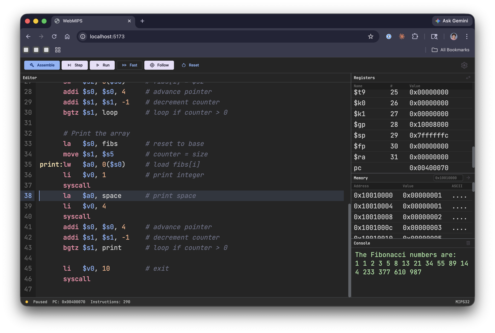

# WebMIPS

WebMIPS is a browser-based MIPS assembly simulator built with TypeScript and Vite. It lets you write MIPS code, assemble it in the browser, and inspect execution through editor, register, memory, and console panels.



## Features

- In-browser MIPS assembler and simulator
- Editor with line numbers, syntax highlighting, and current-line/error highlighting
- Execution controls for `Assemble`, `Step`, `Run`, `Stop`, and `Reset`
- Multiple execution speeds: `Instant`, `Fast`, and `Step`
- Follow mode that auto-scrolls the editor and register panel while running
- Register view with hex/decimal toggle
- Memory viewer with jump-to-address support
- Console output plus interactive input for supported syscalls
- Theme and font-size settings stored in local storage

## Supported Assembly Features

### Directives

- `.text`
- `.data`
- `.word`
- `.half`
- `.byte`
- `.ascii`
- `.asciiz`
- `.space`

### Instructions

Supported core instructions include:

- Arithmetic and logic: `add`, `addu`, `sub`, `subu`, `and`, `or`, `xor`, `nor`, `slt`, `sltu`
- Shifts: `sll`, `srl`, `sra`, `sllv`, `srlv`, `srav`
- Multiply/divide and HI/LO access: `mult`, `multu`, `div`, `divu`, `mfhi`, `mflo`, `mthi`, `mtlo`
- Immediate operations: `addi`, `addiu`, `andi`, `ori`, `xori`, `slti`, `sltiu`, `lui`
- Memory access: `lw`, `sw`, `lb`, `lbu`, `lh`, `lhu`, `sb`, `sh`
- Branch/jump: `beq`, `bne`, `bgtz`, `blez`, `bltz`, `bgez`, `j`, `jal`, `jr`, `jalr`
- System calls: `syscall`

Supported pseudo-instructions include:

- `li`, `la`, `move`, `nop`
- `not`, `neg`, `negu`
- `blt`, `bgt`, `ble`, `bge`
- `bltu`, `bgtu`, `bleu`, `bgeu`
- `mul`

### Syscalls

The simulator currently supports these common syscalls:

- print integer
- print string
- print character
- read integer
- read string
- read character
- exit
- exit with code

## Getting Started

### Install

```bash
npm install
```

### Start the development server

```bash
npm run dev
```

Then open the local Vite URL in your browser.

### Build for production

```bash
npm run build
```

### Run tests

```bash
npm test
```

## How To Use

1. Start the app with `npm run dev`.
2. Edit the sample program in the left editor.
3. Click `Assemble` to compile the program.
4. Use `Step` to execute one instruction at a time, or `Run` to execute continuously.
5. Watch registers, memory, and console output update as the program runs.
6. Use `Reset` to reload the last assembled program.

## Keyboard Shortcuts

- `Ctrl+B`: assemble
- `Ctrl+Enter`: run or stop
- `F10`: step

## Project Structure

```text
src/
  assembler/   Assembly pipeline: lexer, parser, pseudo expansion, encoder
  simulator/   CPU, memory, registers, and syscall handling
  ui/          Browser UI panels and controls
  utils/       Constants and instruction definitions
```

## Notes

- This project implements a practical subset of MIPS instructions, directives, and syscalls for interactive learning and experimentation.
- Programs run entirely in the browser.
- The default editor content is a Fibonacci example program.
